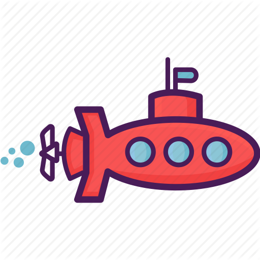
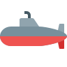
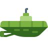
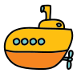
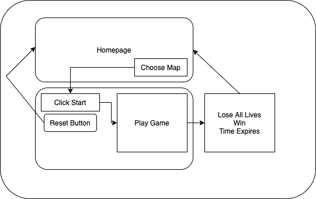

## General Assembly Project 1 

# **Hunt for the Red October**

Timeframe: 

7 days

Goal:

To create a fully functioning browser-based game of your choice using HTML, CSS, and vanilla JavaScript.

Technologies Used:

* HTML5 
* CSS3
* JavaScript (ES6)
* Git
* GitHub
* Google Fonts

The Game:

*Hunt for the Red October* is a 2D, single-player, grid-based-game inspired by Pacman. I modelled the basic logic of the game on the arcade classic but took inspiration from the equally classic 1990 submarine thriller when building the gameplay, the UI, and the UX. 

The aim of the game is to collect all the sunken treasure within the time limit whilst evading enemy submarines. The game ends when the all the treasure is collected, the three-minute time limit expires, or the player loses all their lives.

Play the deployed version here:

<a href='https://clem-code.github.io/project-1/' target='_blank' >https://clem-code.github.io/project-1/</a>

## Building *Hunt for the Red October*

### _The Grid_

At the heart of the *Hunt for the Red October* is a 25-by-25 grid on which the player plays the game. The grid is built programmatically at the beginning of each game session and in each session can host one of five maps, which each pose their own unique challenges. At the beginning of the game the player chooses the map they want to play on and then that map is loaded onto the grid.

	function buildWall(selection) {
	  let sanctum = sanctum1;
	  ///
	  let walls = mapArray[selection];
	  //
	  //creating grid
	  for (let index = 0; index < width ** 2; index++) {
	    const cell = document.createElement("div");
	    cell.classList.add("cell");
	    cell.setAttribute("id", index);
	    cell.setAttribute("row", Math.floor(index / width));
	    cell.setAttribute("column", Math.floor(index % width));
	    grid.appendChild(cell);
	    cells.push(cell);
	    cell.style.width = 100 / width + "%";
	    cell.style.height = 100 / width + "%";
	  }

*A snippet of code showing how the grid is programatically built at the beginning of each session. The 'selection' parameter refers to the map choice the player makes on the opening screen.*

The grid has a number of features: 
* Walls -- impermeable barriers, marked in yellow. 
* Open water -- navigable cells, marked in blue. 
* Sunken Treasure -- diamonds that Pacman can collect to earn points.   
* Sanctuary -- cells in the centre of each map where the NPCs spawn. 
* Junctions -- invisible cells laid down where coluns meet rows to help direct the movements of (some of) the NPCs. 
* Vodka -- as you patrol around you'll come across bottles of vodka. Drink them and you'll get an extra life! These are randomly generated when the map is created and new ones are generated each time they are drunk.   

These are all added to the board using classes:

	 walls.forEach((cell) => {
	    cells[cell].classList.add("wall");
	  });
	  //building sanctum
	  sanctum.forEach((cell) => {
	    cells[cell].classList.add("sanctum");
	  }); 

The player will also notice that periodically some of the cells are lit up by glowing colours. We'll learn about those shortly...

### _The Player_

In homage to Pacman, I refer to the player avatar as Pacman but in fact it's a small red submarine:

Pacman can move in four directions: up, down, left, and right. Movement is continuous: Pacman will continue going in one direction until either he hits a wall OR the player directs him in a different direction.

The directions are generated through event listeners and then passed into a function movChange() which takes the parameter 'direction':

	function movChange(direction) {
	
	    //checks if the move is legal
	    if (cells[pacman + direction].classList.contains("wall")) {
	      console.log("the fail safe has been triggered");
	      return;
	    }
	    
	    //if it is, trigger set interval
	    
	    else if (!cells[pacman + direction].classList.contains("wall")) {
	      clearInterval(directionOfTravel);
	      
	      directionOfTravel = setInterval(() => {
	        
	        //clears if hits an obstacle
	        
	        if (cells[pacman + direction].classList.contains("wall")) {
	          clearInterval(directionOfTravel);
	          console.log("interval cleared");
	          keyControl = 0;
	        }
	        //continues if the way is clear
	        
	        if (!cells[pacman + direction].classList.contains("wall")) {
	          // console.log("the way is clear");
	          cells[pacman].style.transform = "rotateY(0deg)";
	          cells[pacman].classList.remove("pacman");
	          pacman += direction;
	          cells[pacman].classList.add("pacman");
	          cells[pacman].style.transform = pacmanOrientation;
	        }
	      }, 400);
	    }
	  } 

Pacman begins each session with three lives but can win more lives by collecting bottles of vodka. He'll need those bottles though, because if he runs into an enemy submarine he'll lose a life!

Last but not least, Pacman, like any good submarine, is constantly scanning around him using sonar -- these are the funky colours that radiate from him every few seconds. These sonar scans fill the space he's in: so in open water they will go in all four directions but in more confined space they'll only go in one or two.

*A snippet of code showing how the sonar works.*
 

	let pacmanRowArrPosition = parseInt(cells[pacman].getAttribute("column"));

    let pacManColumnArr = cells.filter((cell) => {
      if (
        parseInt(cell.getAttribute("column")) ===
        parseInt(cells[pacman].getAttribute("column"))
      ) {
        return cell;
      }
    });

*First Pacman identifies every cells in the same column as him (pacManColumnArr) whilst simultaneously identifying his place in that column (pacmanRowArrPosition)*
    
    let pacmanColumnArrPosition = parseInt(cells[pacman].getAttribute("row"));
    function rowLeft() {
      for (let index = pacmanRowArrPosition; index >= 0; index--) {
        const cell = pacManRowArr[index];

        if (cell.classList.contains("wall")) {
          // console.log("i am a wall");
          return;
        }
        cell.classList.add("pacmanClose");
      }
    }

*Then he runs a for loop that scans each side of him. So if he is looking in a row then he will look left ( rowLeft() ) and also right ( rowRight() ). The for loop will loop through the cells in that part of the row or column and add the class 'pacmanClose' to all cells that aren't a wall. If it runs up against a wall the loop closes out.*

	.pacmanClose {
	  animation: pacmanCloseColour 2s infinite;
	}
	
	@keyframes pacmanCloseColour {
	  0%, 100% {
	    background-color: midnightblue;
	  }
	  30%, 70%{
	    background-color: mediumblue;
	  }
	  40%,60% {
	    background-color: turquoise;
	  }
	  45%, 55%{
	    background-color: yellowgreen;
	  }
	  48%, 52%{
	    background-color: chartreuse;
	  }
	  50%{
	    background-color: lime;
	  }
	}

*Here's the animation that the class 'pacmanClose' adds to the cells.*

Pacman's sonar rays are a cool design feature but they also impact the game in a very important way because some of the NPCs--those other submarines on the map--can pick up those sonar rays and use them to track down Pacman.

About those submarines...

### _The NPCs_

Making life hard for Pacman are four different NPCs each with their own unique personalities.

 The Hunters 

  

These two are at the very centre of what made *Hunt for the Red October* such a fascinating project to work on. Getting Pacman to move is pretty easy. Getting NPCs to move randomly was also quite simple. Getting the enemy submarines to find and track Pacman was the real challenge -- and that's exactly what these two do.

So how's it done?

Each Hunter is constantly asking two questions: is Pacman in my row? is Pacman in my column?

If the answer to either of these questions is YES then the Hunter will ask another question: if Pacman is in my column, is he above or below me? If Pacman is my row, is he to my left or to my right? Once they know which direction he's in they'll move in that direction.

*A code snippet showing how the Hunters determine if Pacman is in the same column as them:*

	function findPacMan() {
	    //is a pacman trace in my column?
	    //check all cells with same column id
	    let colTraces;
	    //is pacman in my column?
	    if (
	      parseInt(cells[pacman].getAttribute("column")) ===
	      parseInt(cells[submarine].getAttribute("column"))
	    ) {
	      // console.log("we are in the same column");
	      if (
	        parseInt(cells[pacman].getAttribute("row")) >
	        parseInt(cells[submarine].getAttribute("row"))
	      ) {
	        // console.log("pacman is below me");
	        return width;
	      } else {
	        // console.log("pacman is above me");
	        return -width;
	      }
	    } 

However, there's now a problem. When asking if they are in the same row or column as Pacman the Hunters ignore the walls. But when they move the walls, of course, are very much still there. So if they know that Pacman is in their row but there is a wall in the way their movement will be overridden and instead they'll do a random move and start scanning all over again.

This isn't bad: there's at least a 1 in 25 chance Pacman will be in the same row or column as the Hunter. In open water this logic works pretty well. But in more labyrinthine maps the Hunters, well, they get a bit frustrated. Thankfully, they've got another trick up their sleeve.

Here's where it gets interesting. Remember the sonar? As it radiates out from Pacman it leaves traces all over the map. The Hunters can 'see' these traces and use them to guide themselves to Pacman. What's really cool about the traces Pacman leaves behind is that they fill up only the clear space around him. This means that if the Hunters 'see' a trace of Pacman they know there's only clear water between them and that trace -- no pesky walls!

	 const checkCol = cells.some((cell) => {
	      if (
	        cell.getAttribute("column") ===
	          cells[submarine].getAttribute("column") &&
	        cell.classList.contains("pacmanClose")
	      ) {
	        // console.log("this is working", cell, cell.id);
	        colTraces = parseInt(cell.getAttribute("row"));
	        // console.log("this is coltraces", colTraces);
	        return cell;
	      }
	    });
	    // console.log("this is checkCol", checkCol);
	    if (checkCol) {
	      // console.log("we have found a trace");
	      if (colTraces > parseInt(cells[submarine].getAttribute("row"))) {
	        // console.log("pacman is below me");
	        return width;
	      } else {
	        // console.log("pacman is above me");
	        return -width;
	      }

*A snippet of code showing how this Hunter checks to see if there is a trace of Pacman ('pacmanClose) in his column. If there is, then the Hunter uses a the same logic as when Pacman himself is in the same column: he asks is Pacman above or below me? and then uses that to generate a direction of travel.*

This logic is incredibly effective in guiding the Hunters to Pacman, even if he is hiding somewhere. In fact, it was so effective that I modified it slightly so that one of the Hunters can only see traces in their row, and the other can only in see traces in their column. Even with that limitation their still pretty good at tracking Pacman down!

The Drunken Sailor

 
   

There's always one submarine commander in every fleet who's mind's somewhere else! This NPC, as his affectionate nickname suggests, is more interested in vodka than Pacman. He moves around the map looking for the bottle and when he finds it he drinks it and then moves on looking for the next bottle, that is randomly generated when the previous one is consumed. The logic he uses to find the bottle is a version of the one the Hunters use: he searches rows and columns for the vodka and moves in the direction of it where possible. If there is a wall in the way he makes a random move instead. 

The Patroller

 
 

The Patroller has a completely different logic from either the Hunters or the Drunken Sailor. In fact, the code guiding his movement is very similar to that of the player. When the game begins the Patroller makes a move in a random direction and then travels in that direction until he meets a wall, at which point he will stop travelling, make another random move, and travel in that direction as far as he can. Originally, this is where I stopped. But then I noticed something. If the Patroller found himself in a square or rectangular chamber, he would get stuck travelling around the four corners of the room. Similarly, on the maps without walls he would simply travel in straight lines across the map. This made his movements a bit dull so here I added something to spice things up.

Remember the junction cells I mentioned earlier? These exist for the Patroller. Whenever the Patroller moves into a junction cell, he will stop and make another random move. This way he will stop breezing through crossroads and T-junctions and will instead have the opportunity of going down them making his movements a lot less predictable. 

This sounds really simple, but in fact mapping the junction cells onto the grid was a bit of a challenge. I wanted to do as much as possible programatically: that meant I wanted as many of the features of the board to be generated using reusable blocks of code rather than making unique blocks of code for each board. To calculate which cells were junctions I created a function that took each cell, mapped its neighbours, and then determined how many of them were walls. If a junction had three neighbours that were not walls it was designated a junction!

Detecting Contact

Although they have different strategies, all four of the NPCs will cause Pacman to lose a life if he comes into contact with them. How does this work? Well, in the background of the game a set interval is running that is constantly checking to see if anyone of the NPCs are in the same cell on the grid as Pacman. If they are then he will lose a life!

	function detectDeath() {
	    
	    const checker = setInterval(() => {
	      if (
	        cells[pacman].classList.contains("submarine") ||
	        cells[pacman].classList.contains("submarine2") ||
	        cells[pacman].classList.contains("submarine3") ||
	        cells[pacman].classList.contains("submarine4")
	      ) {
	        console.log("pacman is dead");
	        cells.forEach((cell) => {
	          if (cell.classList.contains("pacman")) {
	            return cell.classList.remove("pacman");
	          }
	        });
	        pacman = pacmanCreator();
	        clearInterval(directionOfTravel);
	        currentLives--;
	        if (currentLives > 0) {
	          deathModal();
	        } else if (currentLives < 1) {
	          gameEnd();
	          clearInterval(deathInterval);
	          notifications.innerHTML = "😭YOU LOSE😭";
	          notifications.style.fontSize = "50px";
	        }
	
	        lifeSpan.textContent = currentLives;
	      }
	    }, 150);
	  }

### _Gameplay & UX_

Pacman is a beautifully simple game and I've tried to keep the layout and the gameplay of Hunt for the Red October as intuitive as possible.

The game can be played with two clicks: one to select the map, and a second to begin the gameplay.

Once the game is playing it can be reset by clicking the 'Reset' button which appears in place of the 'Start' button.

The controls are equally pared down: using old-school WASD controls the player can direct Pacman up using 'w', down using 's', left using 'a', and right using 'd'.

One bug I noticed when I was testing the game was that if the player accidentally hits capslock then the controls won't work. To combat this I made sure the controls weren't case-sensitive. Also, I realized that some players might prefer using the arrow keys, so I enabled those as controls as well. 

If the player wins (or loses) the game play ends, the board clears, a message (and a surprise image!) appears and after a few seconds the player is returned to the opening screen.

Scoreboards and notice boards... 

Adjacent to the grid are four boxes:

1. One contains the 'Start'/'Reset' button. 
1. The second contains the scoreboard: this shows the all-time high score (which uses local storage), a dynamically updated visual of the score of the present game, and shows the number of lives the player has.
1. The third is a message board: it flashes messages about the time remaining, if a life is gained or lost, and shows different messages depending on the outcome of the game.
1. The fourth displays the time in minutes, seconds, and milliseconds. 

Other UX considerations
* To avoid edge cases I wanted to make the layout as bug-proof as possible. This is why once a map is selected all the map buttons disappear unless the game is reset or ends organically.
* Likewise, as soon as it is hit the 'Start' button is replaced by the 'Reset' button.
* I wanted to keep all the action on the same page whilst keeping the different parts of the interface segmented. I think the simple, two-part design looks good. The navigation is done through the map choice buttons -- once you click on the map you want to play, the screen scrolls down to the grid, and the selected map is loaded onto the screen.
 
_UI_

Colour palette: I kept this simple, as well. The basic colours are black and a firey shade of red (#e25822). I also used Crimson for some of the font and for the pulsating animation on the two notice boards.
For the grid I used Midnight Blue for the open water cells, a sandy yellow for the walls, and a Medium Blue for the sanctuary cells. Pacman's sonar radiates between Midnight Blue and Lime.

Font: I used VT323 from Google Fonts to try and replicate a classic arcade font.

There are a couple of nods in the UI to the submarine theme. The top of the page has a [soviet star](https://thenounproject.com/search/?q=communism&i=2356924)--a nice reference to the subject matter of the film *The Hunt for the Red October*. The sanctuary section of each map is in the shape of a crosshair. The pulsating colours in the grid are an homage to the flashing screens in the control room. Finally, I added a [sonar sound](https://freesound.org/people/Divinux/sounds/198412/). This can be toggled on and off through the microphone icon at the very bottom of the page. 

### _The Process_

Before I wrote a single line of code I made a rough plan for the week. It looked like this:

1. Thursday: make the grid
1. Friday: code out Pacman's movements
1. Saturday through Monday: work on the NPCs
1. Tuesday: building the UX and sorting out the UI
1. Wednesday: Animation, UX, UI, cont.
1. Thursday: debugging and tweaking.

How did it work out? Well, I had an MVP by Tuesday so overall I was able to build the bulk of the code ahead of schedule. I was particularly pleased to be able to crack the logic for the two Hunters over the weekend. Once they were behaving correctly, I was able to put the UI, UX, and gameplay together. That having been said, the UX, the UI, and the gameplay took a long time to get working and looking right... In fact, that was probably the bulk of the latter half of the project. Adding the timer and the sonar sounds created a number of design complications that I had to iron out. Just getting the map choice buttons working properly took about half a day!

### _Wins_

Built the MVP ahead of schedule.

Coding out the sonar functionality and making the Hunter submarines able to track and follow Pacman. 

I was very pleased with the two-part layout and the way the game looked and worked.

### _Challenges_

Javacript fundamentals: although this was all built with Vanilla JS, there was so much code involved in building the project that it was a real crash-course in array methods, set intervals, HTML classes, and functions. It all worked out well in the end but there was a lot of heartbreak along the way!

UX -- I didn't hit on the two-part look until Tuesday. Making that work involved a lot of wrestling with margins and flexbox. In retrospect it would have been better to start out with a clear design rather than reorganizing thing everything half way through the project...  

Writing clean code. There was a lot of moving parts in this -- streamlining the code was an endless process.

### _Potential Improvements_

Allowing Pacman to fire torpedoes at the NPCs.

Making the speed at which the NPCs move increase as the game wears on.

Experimenting with alternative ways of making the NPCs track Pacman -- using breadth first search, for example.

Mobile compatibility.