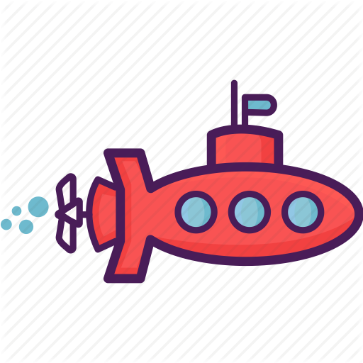

## General Assembly Project 1 

# **Hunt for the Red October**

Timeframe: 

7 days

Goal:

To create a fully functioning browser-based game of your choice using HTML, CSS, and vanilla JavaScript

Technologies Used:

* HTML5 
* CSS3
* JavaScript (ES6)
* Git
* GitHub
* Google Fonts

The Game:

*Hunt for the Red October* is a 2D, single-player, grid-based-game inspired by Pacman. I modelled the basic logic of the game on the arcade classic but took inspiration from the equally classic 1990 submarine thriller when building the design, the gameplay, and the UX. 

The aim of the game is to collect all the sunken treasure within the time limit whilst evading enemy submarines. The game ends when the all the treasure is collected, the three-minute time limit expires, or the player loses all their lives.

Play the deployed version here:

[https://clem-code.github.io/project-1/
]()

Building *Hunt for the Red October*

_The Grid_

At the heart of the *Hunt for the Red October* is a 25-by-25 grid on which the player plays the game. The grid is built programmatically at the beginning of each game session and in each session can host one of five maps, which each pose their own unique challenges. At the beginning of the game the player chooses the map they want to play on and then that map is loaded onto the grid.

The grid has a number of features:
* Walls -- impermeable barriers, marked in yellow.
* Open water -- navigable cells, marked in blue.
* Sunken Treasure -- diamonds that Pacman can collect to earn points. 
* Sanctuary -- cells in the centre of each map where the NPCs spawn.
* Junctions -- invisible cells laid down where coluns meet rows to help direct the movements of (some of) the NPCs.
* Vodka -- as you patrol around you'll come across bottles of vodka. Drink them and you'll get an extra life! These are randomly generated when the map is created and new ones are generated each time they are drunk. 

The player will also notice that periodically some of the cells are lit up by glowing colours. We'll learn about those shortly...

_The Player_

In homage to Pacman, I refer to the player avatar as Pacman but in fact it's a small red submarine:

Pacman can move in four directions: up, down, left, and right. Movement is continuous: Pacman will continue going in one direction until either he hits a wall OR the player directs him in a different direction. 

Pacman begins each session with two lives but can win more lives by collecting bottles of vodka. He'll need those bottles though, because if he runs into an enemy submarine he'll lose a life!

Last but not least, Pacman, like any good submarine, is constantly scanning around him using sonar -- these are those funky colours that radiate from him every few seconds. These sonar scans fill the space he's in: so in open water they will go in all four directions but in more confined space they'll only go in one or two.

Pacman's sonar rays are a cool design feature but they also impact the game in a very important way because some of the NPCs--those other submarines on the map--can pick up those sonar rays and use them to track down Pacman.

About those submarines...

_The NPCs_

Making life hard for Pacman are four different NPCs each with their own unique personalities.

The Hunters 

 
 

These two are at the very centre of what made Hunt for the Red October such a fascinating project to work on. Getting Pacman to move is pretty easy. Getting NPCs to move randomly was also quite simple. Getting the enemy submarines to find and track Pacman was the real challenge -- and that's exactly what these two do.

So how's it done?

Each Hunter is constantly asking two questions: is Pacman in my row? is Pacman in my column?

If the answer to either of these questions is YES then the Hunter will ask another question: if Pacman is in my column, is he above or below me? If Pacman is my row, is he to my left or to my right? Once they know which direction he's in they'll move in that direction. 

However, there's now a problem. When asking if they are in the same row or column as Pacman the Hunters ignore the walls. But when they move the walls, of course, are very much still there. So if they know that Pacman is in their row but there is a wall in the way their movement will be overridden and instead they'll do a random move and start scanning all over again.

This isn't bad: there's at least a 1 in 25 chance Pacman will be in the same row or column as the Hunter. In open water this logic works pretty well. But in more labyrinthine maps the Hunters, well, they get a bit frustrated. Thankfully, they've got another trick up their sleeve.

Here's where it gets interesting. Remember the sonar? As it radiates out from Pacman it leaves traces all over the map. The Hunters can 'see' these traces and use them to guide themselves to Pacman. What's really cool about the traces Pacman leaves behind is that they fill up only the clear space around him. This means that if the Hunters 'see' a trace of Pacman they know there's only clear water between them and that trace -- no pesky walls!

This logic is incredibly effective in guiding the Hunters to Pacman, even if he is hiding somewhere. In fact, it was so effective that I modified it slightly so that one of the Hunters can only see traces in their row, and the other can only in see traces in their column. Even with that limitation their still pretty good at tracking Pacman down!

The Drunken Sailor
  

There's always one submarine commander in every fleet who's mind's somewhere else! This NPC, as his affectionate nickname suggests, is more interested in vodka than Pacman. He moves around the map looking for the bottle and when he finds it he drinks it and then moves on looking for the next bottle, that is randomly generated when the previous one is consumed. The logic he uses to find the bottle is a version of the one the Hunters use: he searches rows and columns for the vodka and moves in the direction of it where possible. If there is a wall in the way he makes a random move instead. 

The Patroller

The Patroller has a completely different logic from either the the Hunters or the Drunken Sailor. In fact, the code guiding his movement is very similar to that of the player's. When the game begins the Patroller makes a move in a random direction and then travels in that direction until he meets a wall, at which point he will stop travelling, make another random move, and travel in that direction as far as he can. Originally, this is where I stopped. But then I noticed something. If the Patroller found himself in a square or rectangular chamber, he would get stuck travelling around the four corners of the room. Similarly, on the maps without walls he would simply travel in straight lines across the map. This made his movements a bit dull so here I added something to spice things up.

Remember the junction cells I mentioned earlier? These exist for the Patroller. Whenever the Patroller moves into a junction cell, he will stop and make another random move. This way he will stop breezing through crossroads and T-junctions and will instead have the opportunity of going down them making his movements a lot less predictable. 

This sounds really simple, but in fact mapping the junction cells onto the grid was a bit of a challlenge. I wanted to do as much as possible programatically: that meant I wanted as many of the features of the board to be generated using reusable blocks of code rather than making unique blocks of code for each board. To calculate which cells were junctions I created a function that took each cell, mapped its neighbours, and then determined how many of them were walls. If a junction had three neighbours that were not walls it was designated a junction!

Detecting Contact

 

